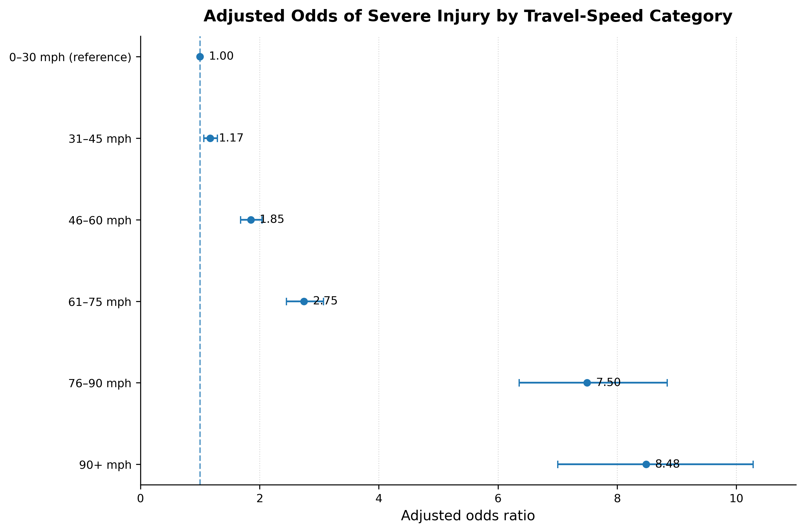
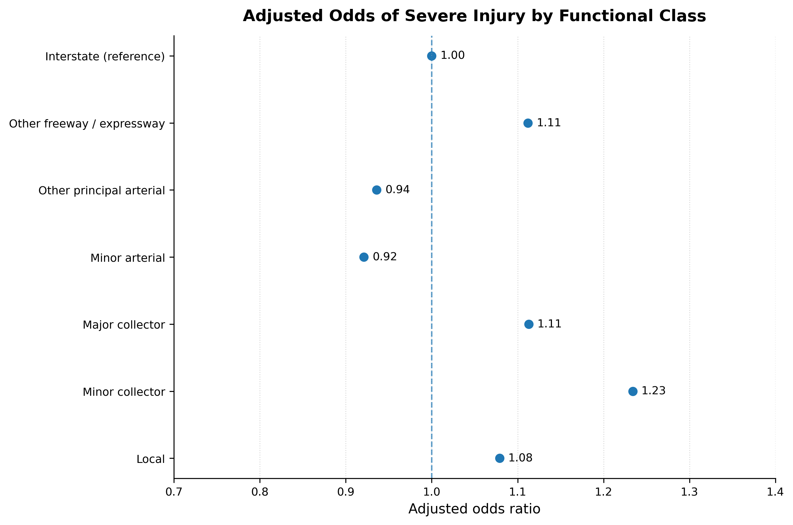
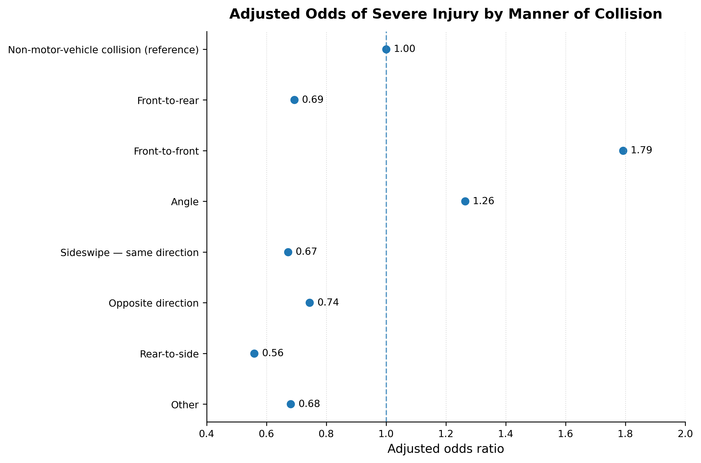

# Data-Driven Traffic Safety Risk Analysis

## Factors Associated with Crash Injury Severity

This project examines roadway, environmental, temporal, vehicle, and collision-related factors associated with injury severity among motor-vehicle occupants involved in fatal crashes.

The analysis uses the 2023 Fatality Analysis Reporting System (FARS) data from the National Highway Traffic Safety Administration (NHTSA) and applies exploratory data analysis and binary logistic regression to identify factors associated with higher or lower odds of severe injury.

### Research Question

**Which roadway, environmental, temporal, speed, and collision-related factors are associated with higher crash injury severity?**

## Data Source

The analysis uses the 2023 Fatality Analysis Reporting System (FARS) National data provided by the National Highway Traffic Safety Administration (NHTSA).

The main data files used in this project are:

- `PERSON.csv` — person-level information, including injury severity
- `ACCIDENT.csv` — crash-level roadway, environmental, lighting, time, and location characteristics
- `VEHICLE.csv` — vehicle-level speed, trafficway, and collision information

## Study Population

The analysis focuses on motor-vehicle occupants involved in fatal crashes.

From the 2023 FARS PERSON data:

- 92,768 person records were available.
- 82,893 motor-vehicle occupants were identified using `PER_TYP`.
- 81,269 occupants had valid injury-severity information and were included in the primary analysis.

### Injury Severity Outcome

Injury severity was converted into a binary outcome:

- **Severe injury:** Suspected Serious Injury or Fatal Injury (`INJ_SEV` = 3 or 4)
- **Non-severe injury:** No Apparent Injury, Possible Injury, or Suspected Minor Injury (`INJ_SEV` = 0, 1, or 2)

Among the 81,269 valid observations:

- Severe injury: **41,361 (50.9%)**
- Non-severe injury: **39,908 (49.1%)**

## Variables Included

The analysis considers variables representing several dimensions of crash and roadway conditions:

### Roadway Characteristics

- Urban/rural setting
- Road functional class
- Intersection involvement
- Trafficway type

### Environmental and Temporal Factors

- Lighting condition
- Weather condition
- Time of day

### Vehicle and Collision Factors

- Speed-related crash involvement
- Travel speed
- Manner of collision

## Methodology

The project follows a data-driven analytical workflow:

1. Data collection from the 2023 NHTSA FARS National dataset
2. Data understanding and variable selection
3. Data cleaning and preprocessing
4. Exploratory data analysis
5. Binary logistic regression
6. Estimation of odds ratios with 95% confidence intervals
7. Interpretation of statistically significant associations
8. Visualization and documentation for reproducibility

Clustered standard errors at the crash (`ST_CASE`) level are used to account for multiple occupants belonging to the same crash.

## Exploratory Findings

Exploratory analysis was conducted to examine how severe injury varied across roadway, environmental, temporal, speed-related, and collision characteristics.

Among the 81,269 occupants included in the primary analysis:

- **50.9%** experienced severe injury.
- **49.1%** experienced non-severe injury.

### Urban and Rural Setting

Among occupants involved in fatal crashes, severe injury was more common in rural than urban settings.

- Rural: **60.0%** severe injury
- Urban: **44.0%** severe injury

### Lighting Condition

The proportion of severe injury was:

- Daylight: **52.79%**
- Dark conditions: **48.79%**

The difference was relatively small at the descriptive level.

### Weather Condition

The proportion of severe injury was:

- Clear weather: **50.23%**
- Adverse or other reported weather: **51.38%**

The descriptive difference was small.

### Intersection Involvement

Severe injury was more common among occupants involved in non-intersection crashes than intersection crashes:

- Non-intersection: **54.07%**
- Intersection: **43.58%**

### Road Functional Class

The proportion of severe injury varied across roadway functional classes:

- Interstate: **47.14%**
- Other Freeways/Expressways: **48.46%**
- Other Principal Arterial: **46.39%**
- Minor Arterial: **49.37%**
- Major Collector: **59.56%**
- Minor Collector: **64.86%**
- Local: **60.07%**

### Time of Day

The proportion of severe injury varied across time periods:

- Night: **56.07%**
- Morning: **52.10%**
- Afternoon: **51.94%**
- Evening: **46.03%**

### Speed-Related Crash Involvement

Speed-related crashes showed the strongest descriptive difference among the main binary variables examined.

- Not speed-related: **44.15%** severe injury
- Speed-related: **73.92%** severe injury

Thus, severe injury was substantially more common among occupants involved in crashes classified as speed-related.

### Travel Speed

Travel-speed information was available for **31,974** observations and missing for **49,295 observations (60.66%)**.

Among observations with available travel-speed information, the proportion of severe injury generally increased across higher speed categories.

This pattern was examined further using a separate logistic regression model with categorized travel speed.

## Descriptive Statistics

### Table 1. Descriptive distribution of severe injury by study characteristic

| Characteristic | Category | Severe injury (%) |
|---|---|---:|
| **Urban/rural setting** | Rural | 60.00 |
| | Urban | 44.00 |
| **Lighting condition** | Daylight | 52.79 |
| | Dark | 48.79 |
| **Weather condition** | Clear weather | 50.23 |
| | Adverse/other reported weather | 51.38 |
| **Intersection involvement** | Non-intersection | 54.07 |
| | Intersection | 43.58 |
| **Functional class** | Interstate | 47.14 |
| | Other Freeway/Expressway | 48.46 |
| | Other Principal Arterial | 46.39 |
| | Minor Arterial | 49.37 |
| | Major Collector | 59.56 |
| | Minor Collector | 64.86 |
| | Local | 60.07 |
| **Time period** | Night | 56.07 |
| | Morning | 52.10 |
| | Afternoon | 51.94 |
| | Evening | 46.03 |
| **Speed-related involvement** | Not speed-related | 44.15 |
| | Speed-related | 73.92 |
| **Travel speed** | 0–30 mph | 31.57 |
| | 31–45 mph | 36.84 |
| | 46–60 mph | 51.38 |
| | 61–75 mph | 54.34 |
| | 76–90 mph | 76.98 |
| | 90+ mph | 78.37 |
| **Trafficway type** | Non-Trafficway/Driveway | 33.91 |
| | Two-Way, Not Divided | 56.50 |
| | Two-Way Divided, Unprotected Median | 45.63 |
| | Two-Way Divided, Positive Median Barrier | 43.85 |
| | One-Way Trafficway | 44.78 |
| | Two-Way, Not Divided with Continuous Left-Turn Lane | 40.41 |
| | Entrance/Exit Ramp | 62.17 |
| | Two-Way Divided, Unknown Median | 47.57 |
| **Manner of collision** | Non-MVT collision | 53.51 |
| | Front-to-Rear | 39.00 |
| | Front-to-Front | 62.28 |
| | Angle | 47.53 |
| | Sideswipe, Same Direction | 37.38 |
| | Sideswipe, Opposite Direction | 42.71 |
| | Rear-to-Side | 40.43 |
| | Other Collision | 36.54 |

**Note:** Percentages are the within-category proportion of occupants classified as having severe injury. Variable-specific missing values were excluded from the corresponding descriptive calculation. The overall study population contained 81,269 occupants with valid injury-severity information; travel-speed categories are based on the 31,974 observations with available travel-speed information.

## Regression Results

Two binary logistic regression models were developed to examine factors associated with severe injury among motor-vehicle occupants involved in fatal crashes.

### Model 1: Speed-Related Crash Involvement

Model 1 included speed-related crash involvement as a binary predictor along with roadway, environmental, temporal, trafficway, and collision-related variables.

- Observations: **70,705**
- Pseudo R²: **0.0825**
- Speed-related crash involvement: **OR = 3.737**
- 95% CI: **3.527–3.960**
- p-value: **< 0.001**

Among occupants involved in fatal crashes, those in speed-related crashes had approximately **3.74 times the odds of severe injury** compared with those in crashes not classified as speed-related, after adjustment for the other variables included in the model.

### Table 2. Clustered logistic regression results — Model 1

| Variable | OR | 95% CI | p-value |
|---|---:|---:|---:|
| **Functional class** | | | |
| Interstate | 1.000 | Reference | — |
| Other Freeways/Expressways | 1.112 | 1.000–1.236 | 0.0495 |
| Other Principal Arterial | 0.936 | 0.857–1.021 | 0.1367 |
| Minor Arterial | 0.921 | 0.838–1.012 | 0.0861 |
| Major Collector | 1.113 | 1.005–1.232 | 0.0400 |
| Minor Collector | 1.234 | 1.070–1.424 | 0.0039 |
| Local | 1.079 | 0.963–1.208 | 0.1887 |
| **Time period** | | | |
| Night | 1.000 | Reference | — |
| Morning | 0.692 | 0.641–0.747 | <0.001 |
| Afternoon | 0.672 | 0.623–0.725 | <0.001 |
| Evening | 0.658 | 0.622–0.696 | <0.001 |
| **Trafficway type** | | | |
| Non-Trafficway/Driveway | 1.000 | Reference | — |
| Two-Way, Not Divided | 1.957 | 1.615–2.372 | <0.001 |
| Two-Way Divided, Unprotected Median | 1.750 | 1.439–2.128 | <0.001 |
| Two-Way Divided, Positive Median Barrier | 1.546 | 1.258–1.901 | <0.001 |
| One-Way Trafficway | 1.729 | 1.352–2.211 | <0.001 |
| Two-Way, Not Divided with Continuous Left-Turn Lane | 1.407 | 1.150–1.722 | <0.001 |
| Entrance/Exit Ramp | 2.964 | 2.295–3.828 | <0.001 |
| Two-Way Divided, Unknown Median | 1.790 | 1.318–2.430 | <0.001 |
| **Manner of collision** | | | |
| Non-MVT collision | 1.000 | Reference | — |
| Front-to-Rear | 0.693 | 0.649–0.739 | <0.001 |
| Front-to-Front | 1.792 | 1.692–1.899 | <0.001 |
| Angle | 1.264 | 1.202–1.330 | <0.001 |
| Sideswipe, Same Direction | 0.672 | 0.604–0.746 | <0.001 |
| Sideswipe, Opposite Direction | 0.744 | 0.645–0.859 | 0.0001 |
| Rear-to-Side | 0.559 | 0.357–0.874 | 0.0108 |
| Other Collision | 0.681 | 0.537–0.864 | 0.0015 |
| **Binary predictors** | | | |
| Rural | 1.000 | Reference | — |
| Urban | 0.636 | 0.610–0.663 | <0.001 |
| Daylight | 1.000 | Reference | — |
| Dark | 0.740 | 0.698–0.784 | <0.001 |
| Clear weather | 1.000 | Reference | — |
| Adverse/other reported weather | 0.955 | 0.911–1.001 | 0.0527 |
| Non-intersection | 1.000 | Reference | — |
| Intersection | 0.708 | 0.677–0.741 | <0.001 |
| Not speed-related | 1.000 | Reference | — |
| Speed-related | 3.737 | 3.527–3.960 | <0.001 |

**Model 1:** N = 70,705; clustered standard errors at `ST_CASE` level; pseudo R² = 0.0825. Odds ratios are adjusted for all other variables in the model.

### Model 2: Travel Speed

Model 2 replaced the binary speed-related variable with categorized travel speed to examine whether the association with severe injury varied across different speed ranges.

- Observations: **28,437**
- Pseudo R²: **0.0914**
- Reference category: **0–30 mph**

Adjusted odds ratios for travel speed were:

- **31–45 mph:** OR = **1.171**
- **46–60 mph:** OR = **1.851**
- **61–75 mph:** OR = **2.745**
- **76–90 mph:** OR = **7.496**
- **90+ mph:** OR = **8.485**

The results show a clear increase in the adjusted odds of severe injury across higher travel-speed categories.

The Model 2 sample is substantially smaller because travel-speed information was missing for **49,295 of the 81,269** valid injury-severity observations (**60.66%**).

### Table 3. Clustered logistic regression results — Model 2

| Variable | OR | 95% CI | p-value |
|---|---:|---:|---:|
| **Functional class** | | | |
| Interstate | 1.000 | Reference | — |
| Other Freeways/Expressways | 0.960 | 0.823–1.120 | 0.603 |
| Other Principal Arterial | 1.239 | 1.084–1.415 | 0.002 |
| Minor Arterial | 1.350 | 1.169–1.558 | <0.001 |
| Major Collector | 1.650 | 1.408–1.933 | <0.001 |
| Minor Collector | 1.978 | 1.597–2.452 | <0.001 |
| Local | 1.944 | 1.633–2.315 | <0.001 |
| **Time period** | | | |
| Night | 1.000 | Reference | — |
| Morning | 0.732 | 0.646–0.829 | <0.001 |
| Afternoon | 0.720 | 0.635–0.816 | <0.001 |
| Evening | 0.688 | 0.628–0.754 | <0.001 |
| **Travel speed category** | | | |
| 0–30 mph | 1.000 | Reference | — |
| 31–45 mph | 1.171 | 1.063–1.290 | 0.0014 |
| 46–60 mph | 1.851 | 1.679–2.040 | <0.001 |
| 61–75 mph | 2.745 | 2.451–3.074 | <0.001 |
| 76–90 mph | 7.496 | 6.355–8.841 | <0.001 |
| 90+ mph | 8.485 | 7.003–10.280 | <0.001 |
| **Trafficway type** | | | |
| Non-Trafficway/Driveway | 1.000 | Reference | — |
| Two-Way, Not Divided | 1.354 | 0.952–1.926 | 0.0920 |
| Two-Way Divided, Unprotected Median | 1.179 | 0.826–1.684 | 0.3642 |
| Two-Way Divided, Positive Median Barrier | 1.012 | 0.699–1.466 | 0.9504 |
| One-Way Trafficway | 1.584 | 0.956–2.625 | 0.0744 |
| Two-Way, Not Divided with Continuous Left-Turn Lane | 0.958 | 0.664–1.382 | 0.8178 |
| Entrance/Exit Ramp | 2.470 | 1.583–3.854 | <0.001 |
| Two-Way Divided, Unknown Median | 1.804 | 1.068–3.045 | 0.0273 |
| **Manner of collision** | | | |
| Non-MVT collision | 1.000 | Reference | — |
| Front-to-Rear | 0.999 | 0.909–1.097 | 0.9798 |
| Front-to-Front | 1.597 | 1.454–1.755 | <0.001 |
| Angle | 1.355 | 1.247–1.473 | <0.001 |
| Sideswipe, Same Direction | 0.705 | 0.593–0.837 | <0.001 |
| Sideswipe, Opposite Direction | 0.580 | 0.439–0.766 | <0.001 |
| Rear-to-Side | 1.434 | 0.503–4.090 | 0.4998 |
| Other Collision | 0.613 | 0.361–1.043 | 0.0709 |
| **Binary predictors** | | | |
| Rural | 1.000 | Reference | — |
| Urban | 0.773 | 0.721–0.829 | <0.001 |
| Daylight | 1.000 | Reference | — |
| Dark | 0.712 | 0.646–0.786 | <0.001 |
| Clear weather | 1.000 | Reference | — |
| Adverse/other reported weather | 1.017 | 0.948–1.091 | 0.6341 |
| Non-intersection | 1.000 | Reference | — |
| Intersection | 0.763 | 0.708–0.823 | <0.001 |

**Model 2:** N = 28,437; clustered standard errors at `ST_CASE` level; pseudo R² = 0.0914. Odds ratios are adjusted for all other variables in the model.

## Key Findings

Several variables showed meaningful associations with severe injury among occupants involved in fatal crashes.

### Speed

Speed was the strongest predictor examined in the analysis.

- Speed-related crash involvement was associated with approximately **3.74 times higher odds** of severe injury.
- In the travel-speed model, the adjusted odds increased progressively across higher speed categories.
- Occupants in crashes involving **76–90 mph** had approximately **7.50 times the odds** of severe injury compared with the 0–30 mph reference group.
- Occupants in crashes involving **90+ mph** had approximately **8.48 times the odds**.

### Roadway Characteristics

Compared with Interstate roadways in Model 2:

- Other Principal Arterials had OR = **1.239**
- Minor Arterials had OR = **1.350**
- Major Collectors had OR = **1.650**
- Minor Collectors had OR = **1.978**
- Local roads had OR = **1.944**

Entrance/exit ramps also showed elevated odds of severe injury compared with the non-trafficway/driveway reference category (OR = **2.470**).

### Collision Type

Compared with non-motor-vehicle-in-transport collisions:

- Front-to-front collisions had OR = **1.597**
- Angle collisions had OR = **1.355**
- Sideswipe collisions in the same direction had OR = **0.705**
- Sideswipe collisions in the opposite direction had OR = **0.580**

### Urban/Rural Setting

Urban crashes had lower adjusted odds of severe injury than rural crashes in Model 2 (OR = **0.773**).

This corresponds to approximately **1.29 times higher odds in rural settings** relative to urban settings, holding the other variables in the model constant.

### Environmental and Temporal Factors

Dark conditions showed lower adjusted odds than daylight conditions in Model 2 (OR = **0.712**).

Morning, afternoon, and evening periods also showed lower adjusted odds than the night reference period.

Adverse weather was not statistically significant in either model at the 0.05 significance level.

## Limitations

Several limitations should be considered when interpreting the results.

- The analysis uses **fatal-crash data**, so the findings describe associations among occupants involved in fatal crashes rather than risk across all crashes.
- The study is observational; therefore, the estimated associations should **not be interpreted as causal effects**.
- Travel-speed information was missing for **60.66%** of the valid injury-severity observations, resulting in a substantially smaller sample for Model 2.
- The `TRAV_SP` value of `0` represents a stopped motor vehicle in-transport and does not necessarily mean that the vehicle was measured at exactly 0 mph.
- The binary severe-injury outcome combines suspected serious injury and fatal injury, which may represent different injury mechanisms.
- Odds ratios describe associations with the modeled outcome and should not be interpreted as probabilities of injury.
- Pseudo R² values describe model fit and should not be interpreted as prediction accuracy.
- Some variables contain reported unknown or missing values, which were excluded from the complete-case regression models.
- The analysis does not account for every possible factor that may influence injury severity.

## Figures

The project includes visualizations of the main regression findings, including:

- Adjusted odds ratios by travel-speed category
- Adjusted odds ratios by roadway functional class
- Adjusted odds ratios by manner of collision

The regression figures display adjusted odds ratios with **95% confidence intervals** shown where available, and use an odds-ratio reference line at **OR = 1**.

### Travel Speed



### Roadway Functional Class



### Manner of Collision



## Reproducibility

The analysis was conducted using Python in Google Colab.

The workflow is designed to be reproducible from the original 2023 NHTSA FARS National dataset. The analysis includes data loading, preprocessing, variable recoding, exploratory analysis, regression modeling, and visualization.

The project files and analysis outputs are organized to allow the workflow to be reviewed and reproduced by other researchers.

## Project Structure

```text
traffic-safety-risk-analysis/
├── data/
├── notebooks/
├── src/
├── outputs/
│   ├── figures/
│   └── tables/
├── README.md
├── requirements.txt
└── LICENSE
```

## Tools and Technologies

- Python
- Google Colab
- Pandas
- NumPy
- Statsmodels
- Matplotlib
- NHTSA FARS 2023 National Dataset
- Binary Logistic Regression
- Exploratory Data Analysis

## Conclusion

This project demonstrates a data-driven approach to examining factors associated with injury severity in fatal crashes.

The analysis identifies **speed-related crash involvement and higher travel-speed categories** as the strongest associations with severe injury in the study population. Roadway functional class, trafficway type, collision manner, urban/rural setting, lighting condition, and time of day also showed meaningful associations in the regression models.

The results provide an analytical framework for understanding patterns in traffic injury severity and demonstrate the use of real-world crash data, statistical modeling, and reproducible data analysis for transportation safety research.
